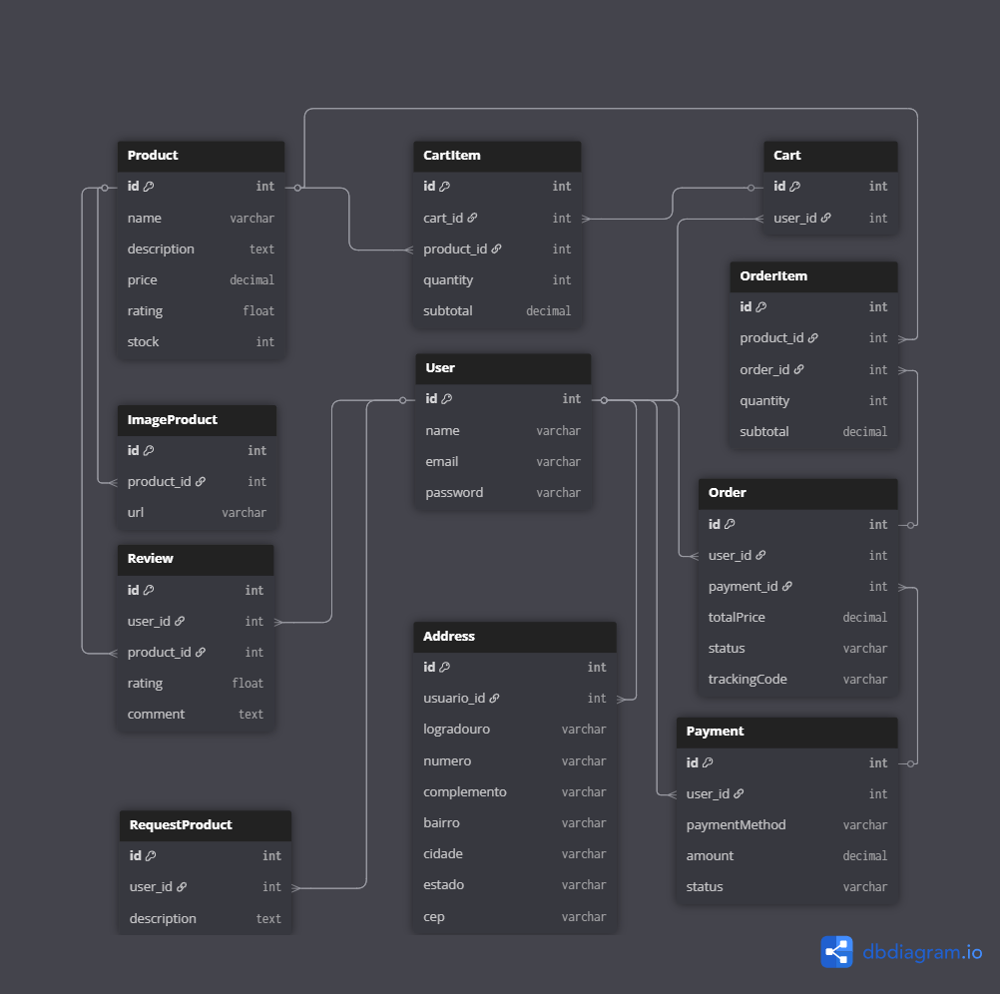

# 💳 Tornearia Central Shop - E-commerc

Este projeto é um e-commerc, desenvolvido na diciplina de Full Cycle com **Spring Boot (Java)** no backend e **React** no frontend.

---

## ⚙️ Tecnologias Utilizadas

### Backend
- Java 17
- Spring Boot
- Mercado Pago Java SDK
- JPA / Hibernate
- MySQL
- Maven

### Frontend
- React
- Vite
- @mercadopago/sdk-react
- Axios
- JWT para autenticação

---

## 🛠️ Como Executar o Projeto

### Pré-requisitos

- Java 17
- Node.js 18+
- MySQL
- Conta no [Mercado Pago Developer](https://www.mercadopago.com.br/developers/panel) (modo Sandbox)

---

# Banco de Dados

```bash
- Certifique-se de ter um banco de dados MySQL rodando.
- Crie o banco de dados com o nome definido no arquivo `application.properties`. # Citado a baixo
- Execute as migrations com o comando:
mvn flyway:migrate

- insert para exemplo:
INSERT INTO product (id, name, description, price, rating, stock) VALUES
(1, 'Porca 2mm', 'Porcar 2mm interno, 4mm externo, rosca 1.5', 10.99, 0, 6),
(2, 'Pacote de estopa', 'A Estopa usado para a limpeza de Pistola de Pintura peças e superfícies sujas de graxa e óleo.', 5.00, 0, 48),
(3, 'Torneira Industrial', 'Torneira de alta pressão para uso industrial', 150.00, 0, 10),
(4, 'Válvula Reguladora', 'Válvula para controle de fluxo de água', 75.00, 0, 20),
(5, 'Registro Esférico', 'Registro esférico de latão reforçado', 120.00, 0, 15),
(6, 'Filtro de Água', 'Filtro de água com carvão ativado', 85.00, 0, 24),
(7, 'Mangueira Flexível', 'Mangueira de borracha flexível para torneira', 45.00, 0, 29),
(8, 'Adaptador Rosqueado', 'Adaptador de rosca para conexões hidráulicas', 35.00, 0, 50),
(9, 'Engate Rápido', 'Engate rápido para mangueiras e torneiras', 60.00, 0, 40),
(10, 'Chuveiro Pressurizado', 'Chuveiro com sistema de pressurização de água', 180.00, 0, 12),
(11, 'Vedante de Silicone', 'Vedante de silicone para torneiras e encanamentos', 20.00, 0, 98),
(12, 'Esguicho Regulável', 'Esguicho com regulagem de pressão para jardim', 55.00, 0, 35);
```

### Backend (Spring Boot)

```bash
# Acesse o diretório do backend
cd backend

# Configure o application.properties
# Exemplo:
spring.datasource.url=jdbc:mysql://localhost:3306/torneariadb
spring.datasource.username=seu_usuario
spring.datasource.password=sua_senha
mp.key=SEU_ACCESS_TOKEN_DO_MERCADO_PAGO

# Compile e rode o projeto
mvn spring-boot:run
# Se não funcionar, rode
mvnw spring-boot:run
```

---

### Frontend (React)

```bash
# Acesse o diretório do frontend
Esse projeto usa as seguintes bibliotecas além do React:

- react-icons
- framer-motion
- @mercadopago/sdk-react

cd frontend

# Instale as dependências
npm install

# Rode o projeto
npm run dev
```

No código React, o Public Key do Mercado Pago deve estar configurado:

```js
initMercadoPago("SEU_PUBLIC_KEY_SANDBOX", { locale: "pt-BR" });
```

---

## 🔒 Atenção: Tokens Mercado Pago

- **Public Key:** Usada no frontend, pode ficar no código.
- **Access Token:** Usado apenas no backend, nunca deve ser exposto no frontend ou no GitHub.

---

## 📁 Estrutura do Projeto

```
backend/
 └── src/main/java/br/com/torneariacentralshop/java
      ├── api
      ├── auth (JWT)
      ├── controllers
      ├── dtos
      ├── entities
      ├── enums
      ├── mappers
      ├── repository
      └── services

frontend/
 └── src
      ├── Components
      ├── Controller
      ├── Layout
      └── pages

Banco
```



---

## ✅ Fluxo Resumido

1. Usuário pode se cadastrar na plataforma.
2. Backend retorna os produtos cadastrados no banco para exibir no Front.
3. Usuario pode adicionar item no carrinho, como também pode remover.
4. Usuario pode fazer a compra do carrinho.
5. Se o pagamento for aprovado, um registro de pagamento e um pedido são criados no banco de dados.
6. Usuario pode acompanhar seus pedidos


---

## 🧪 Próximos Passos (Melhorias)

- Integrar o reviw dos produtos
- Melhorar perfil do usuario
- Integrar codigo do pedido para entrega
- Envio de e-mail após aprovação de pagamento  
- Melhora área de consulta de pedidos  
- Dockerizar 
- Deploy em ambiente de produção  

---

## 🧑‍💻 Desenvolvido por

Athams Menezes  
[https://www.linkedin.com/in/athams-337346274/]  
