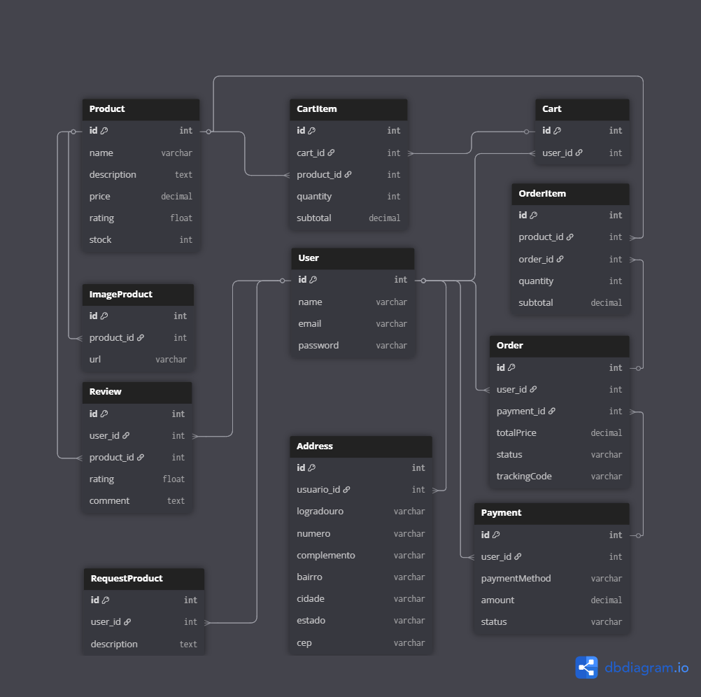

# ⚙️🛠️ Tornearia Central Shop - E-commerce

Este projeto é um e-commerce, desenvolvido na disciplina de Full Cycle com **Spring Boot (Java)** no backend e **React** no frontend.

---

## ⚙️ Tecnologias Utilizadas

### Backend
- Java 17
- Spring Boot
- Mercado Pago Java SDK
- JPA / Hibernate
- MySQL
- Maven
- JWT para autenticação

### Frontend
- React
- Vite
- Tailwind
- @mercadopago/sdk-react
- Axios
  
---

## 🛠️ Como Executar o Projeto

### Pré-requisitos

- Java 17+
- Node.js 18+
- MySQL
- Conta no [Mercado Pago Developer](https://www.mercadopago.com.br/developers/panel) (modo Sandbox)

---

# Banco de Dados

```bash
- Certifique-se de ter um banco de dados MySQL rodando.
- Crie o banco de dados com o nome definido no arquivo `application.properties`. # Citado abaixo
- Execute as migrations com o comando:
mvn flyway:migrate
```

### Backend (Spring Boot)

```bash
# Acesse o diretório do backend
cd backend

# Configure o application.properties
# Exemplo:
spring.datasource.url=jdbc:mysql://localhost:3306/torneariadb
spring.datasource.username=seu_usuario
spring.datasource.password=sua_senha
mp.key=SEU_ACCESS_TOKEN_DO_MERCADO_PAGO

# Compile e rode o projeto
mvn spring-boot:run
# Se não funcionar, rode
mvnw spring-boot:run
```

---

### Frontend (React)

```bash
# Acesse o diretório do frontend
Esse projeto usa as seguintes bibliotecas além do React:

- react-icons
- framer-motion
- @mercadopago/sdk-react

cd frontend

# Instale as dependências
npm install

# Rode o projeto
npm run dev
```

No código React, o Public Key do Mercado Pago deve estar configurado:

```js
initMercadoPago("SEU_PUBLIC_KEY_SANDBOX", { locale: "pt-BR" });
```

---

## 🔒 Atenção: Tokens Mercado Pago

- **Public Key:** Usada no frontend, pode ficar no código.
- **Access Token:** Usado apenas no backend, nunca deve ser exposto no frontend ou no GitHub.

---

## 📁 Estrutura do Projeto

```
backend/
 └── src/main/java/br/com/torneariacentralshop/java
      ├── api
      ├── auth (JWT)
      ├── controllers
      ├── dtos
      ├── entities
      ├── enums
      ├── mappers
      ├── repository
      └── services

frontend/
 └── src
      ├── Components
      ├── Controller
      ├── Layout
      └── pages

```

---

## 🛢 Banco



---

## ✅ Fluxo Resumido

1. Usuário pode se cadastrar na plataforma.
2. Backend retorna os produtos cadastrados no banco para exibir no Front.
3. Usuario pode adicionar item no carrinho, como também pode remover.
4. Usuario pode fazer a compra do carrinho.
5. Se o pagamento for aprovado, um registro de pagamento e um pedido são criados no banco de dados.
6. Usuario pode acompanhar seus pedidos


---

## 🧪 Próximos Passos (Melhorias)

- Integrar o review dos produtos
- Melhorar perfil do usuário
- Integrar codigo do pedido para entrega
- Envio de e-mail após aprovação de pagamento  
- Melhora a área de consulta de pedidos  
- Dockerizar 
- Deploy em ambiente de produção  

--- 
